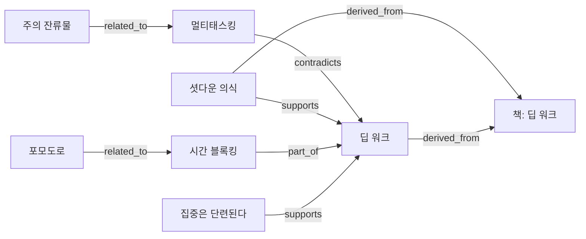

# samples — 실행 가능한 eb 플레이그라운드

`eb-setup`이 빈 저장소에 만들어 주는 결과물과 **같은 형태**의 자체완결 예제 브레인.
엔진(`eb.py`)과 데이터(`data/`)가 함께 있어, clone 후 바로 돌려볼 수 있다.

> `eb.py`는 [`eb-setup`](../.claude/skills/eb-setup/SKILL.md) 절차로 `jhs512/eb`의 고정 ref
> **`v0.2.0`** 에서 fetch한 스냅샷이다(실사용자 저장소가 갖게 될 모습 그대로 — 그래서 루트
> 엔진과 별개로 여기 동봉됨). 엔진을 갱신하려면 samples/ 에서 eb-setup 절차를 다시 돌린다.

## 바로 해보기

```bash
cd samples

python eb.py stats                              # 그래프 요약
python eb.py search 집중                        # 노드 검색(필드 일치 수로 랭크)
python eb.py node pillar-deep-work              # 노드 + 백링크(엣지 타입 다양)
python eb.py suggest concept-pomodoro           # 연결 후보(공통 이웃 + 태그 자카드)
python eb.py path concept-pomodoro pillar-deep-work
python eb.py health                             # 건강도 + 리뷰 큐
python eb.py export --format mermaid            # 그래프를 다른 뷰로(아래 미리보기)
python eb.py validate
```

## 이 브레인 (『딥 워크』)

`eb-learn` 플로우(증류 → 그래프-인지 추가 → validate)로 쌓고, `eb-clean`로 정리(중복
`merge` + 고아 `suggest` 연결)한 결과다. 엣지 타입 `supports / part_of / contradicts /
related_to / derived_from` 를 담고 있고, 출처 노드 `source-book-deepwork`로 `derived_from`
추적이 걸려 있다.

### 그래프 미리보기 (엑셀 말고 다른 뷰)

`python eb.py export --format mermaid` 결과 — 깃허브에서 바로 렌더된다:



`--format dot`(Graphviz) · `--format json`(d3/cytoscape) 으로도 뽑을 수 있다.

```bash
# 직접 지식 추가해 보기 (추가 후 반드시 validate)
python eb.py add-node --id concept-flow --title "몰입(플로우)" --type concept --tags "집중"
python eb.py suggest concept-flow                       # 붙일 곳 제안 확인 후
python eb.py add-edge --source concept-flow --type related_to --target pillar-deep-work --note "딥워크의 심리 상태"
python eb.py validate
```

내 진짜 브레인을 새로 시작하려면, 빈 폴더에서 [`eb-setup`](../.claude/skills/eb-setup/SKILL.md) 절차를 따른다.
